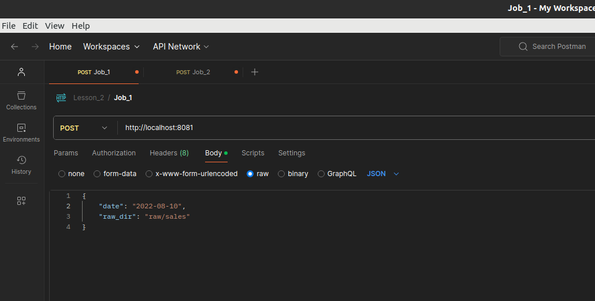
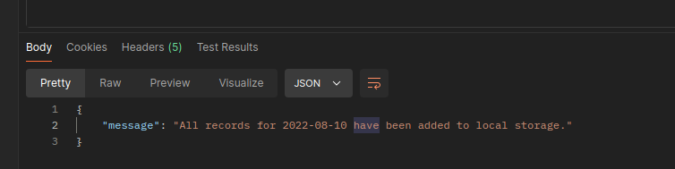
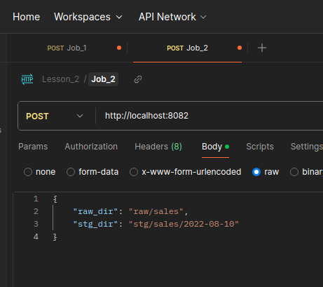
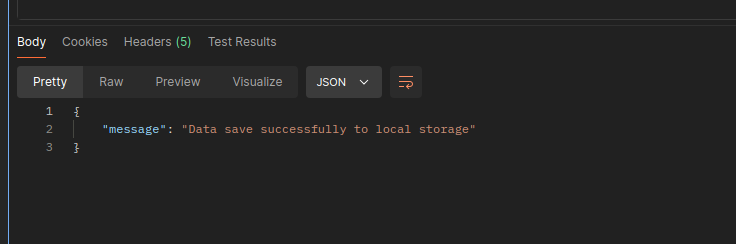
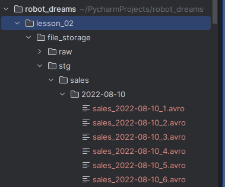
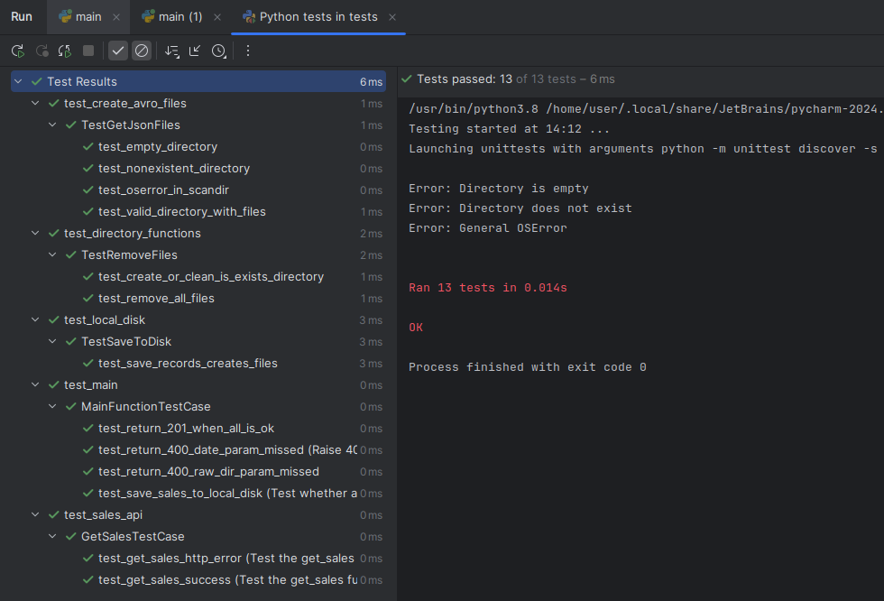

# Extract data from API, transform it to *.avro format and save to local storage

## Цей сервіс призначений для створення запитів до API та збереження данних на локальному сховищі в форматі avro  

## Технології, які використані в проекті
- Flask
- Jinja2
- requests
- Docker 

## Інструкція по розгортанню

### Клонування репозиторію
1. Клонувати репозиторій
    ```sh
    git clone https://github.com/SafonovVladimir/robot_dreams.git
    cd lesson_02
    ```

### Налаштування середовища
2. Створити віртуальне середовище та активувати його
    ```sh
    python -m venv venv
    source venv/bin/activate  # На Windows використовуйте venv\Scripts\activate
    ```

3. Встановити залежності
    ```sh
    pip install -r requirements.txt
    ```
   
4. Налаштування змінних середовища:
    - Створіть файл `.env` у директорії lesson_02.
    - Додайте до нього ваш секретний ключ та інші необхідні змінні середовища:
        ```
        AUTH_TOKEN=YOUR_AUTH_TOKEN
        ```
      
5. Запуск сервера з Job_1:
    - запустити файл main.py
    - сервер запуститься, використовуючи порт 8081


6. Запуск сервера з Job_2:
    - запустити файл main.py
    - сервер запуститься, використовуючи порт 8082


7. Використовуючи Postman або інший додаток, відправити POST запит на порт 8081 в форматі:
```json
{
    "date": "2022-08-10",
    "raw_dir": "raw/sales"
}
```



Результат запиту:


В локальному сховищі (lesson_02/file_storage/raw/sales/2022-08-10) будуть створені json-файли з даними про продажі.

9. Відправити POST запит на порт 8082 в форматі:
```json
{
    "raw_dir": "raw/sales",
    "stg_dir": "stg/sales/2022-08-10"
}
```


Результат запиту :

Буде створена папка stg/sales/2022-08-10 з файлами у форматі *.avro



10. Для запуску тестів достатньо запустити всі тести з каталогу tests


Цей README.md файл містить інформацію про налаштування змінних середовища, 
використання `load_dotenv()` для завантаження секретних ключів та інструкції по встановленню, 
використанню та тестуванню проекту.